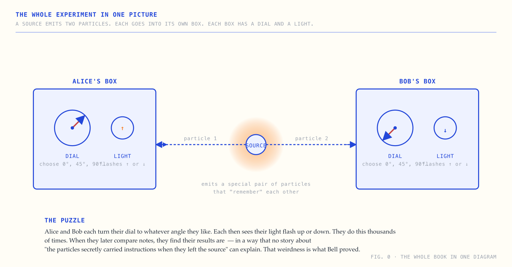

# A Visual Reading of *On the Einstein Podolsky Rosen Paradox*

A four-chapter visual reader for John Stewart Bell's 1964 paper, *On the Einstein Podolsky Rosen Paradox*, published in *Physics*, Vol. 1, No. 3, pp. 195–200. The paper is six pages long, uses no calculus, and contains the proof that any "common-sense" theory of quantum particles — one in which they carry pre-decided answers and distant measurements don't influence each other — must disagree with quantum mechanics on a specific class of experimental predictions. Sixty years later, those experiments have all confirmed Bell was right and Einstein was wrong.

This site redraws the argument with diagrams, plain language, and no math beyond high-school arithmetic. Approximately forty minutes from cover to terminology.

**Live site:** https://bell-1964-visual.vercel.app/ *(after deployment)*

## Visual design

The visual design — cream paper background, deep technical-blue ink, monospace uppercase labels, hand-drawn semi-realistic SVG diagrams, marginalia, and the broader compositional vocabulary — is adopted from Dan Hollick's [**makingsoftware.com**](https://www.makingsoftware.com/). The design system is a direct application of his work to a different subject. The choice of subject and the technical content are the only original contributions in this repository.

## Preview



## Contents

| Page | Description |
|---|---|
| Cover | The whole experiment in one diagram |
| Chapter 1 — The puzzle | A source emits two particles. Each lands in a box with a dial and a light. The lights flash up or down. The puzzle is the pattern of flashes. |
| Chapter 2 — The glove analogy | The "secret tag" explanation Einstein hoped was true, and why it almost works. |
| Chapter 3 — The clever experiment | Bell's idea: three dial settings, a counting argument, an inequality, and the geometric configuration where the universe breaks it. |
| Chapter 4 — What it means | Locality fails; the universe is non-local; experiments have repeatedly confirmed it; Aspect, Clauser, and Zeilinger received the 2022 Nobel Prize. |
| Terminology | Plain-English glossary for every technical word in the book. |

## Local development

```bash
git clone https://github.com/0xadvait/bell-1964-visual.git
cd bell-1964-visual
python3 -m http.server 8000
# open http://localhost:8000/
```

The site has no build step. It consists of hand-written HTML, CSS, and inline SVG, with no JavaScript dependencies.

## Stack

- HTML, CSS, and inline SVG
- No JavaScript or external frameworks
- Mobile responsive (diagrams switch to horizontal-scroll panes below a 720px viewport)
- Deployed on Vercel

## Source

Bell, J. S. (1964). *On the Einstein Podolsky Rosen Paradox.* Physics, 1(3), 195–200.

This is the authoritative source for every claim about Bell's argument made on this site. Modern context (the 2022 Nobel Prize, the loophole-free experiments, the alternative interpretations discussed in chapter 4) is editorially added and cites secondary sources.

## License

The illustrations, prose, HTML, and CSS in this repository are released under the [MIT License](LICENSE). The underlying scientific content — the Bell theorem, its proof, and the EPR thought experiment — is the work of John Stewart Bell, Albert Einstein, Boris Podolsky, and Nathan Rosen, reproduced here under fair-use principles for educational commentary.

The visual design system is adopted from Dan Hollick's [makingsoftware.com](https://www.makingsoftware.com/).

## Related

- **[A Visual Reading of *Perception Based UAV Path Planning for Fruit Harvesting*](https://github.com/0xadvait/perception-uav-thesis-visual)** — Book I in the same series, applying the same design system to Siddharth Kothiyal's 2021 master's thesis on autonomous fruit-picking drones.

## Acknowledgements

- [**Dan Hollick**](https://x.com/DanHollick) ([makingsoftware.com](https://www.makingsoftware.com/)) — for the visual design vocabulary that this site applies.
- **John Stewart Bell** (1928–1990) — the source of every interesting idea on this site.
- **Aspect, Clauser, and Zeilinger** — the experimentalists whose loophole-free Bell tests turned the theorem into established fact.

---

Maintained by [@0xadvait](https://github.com/0xadvait) ([X](https://x.com/advait_jayant)).
